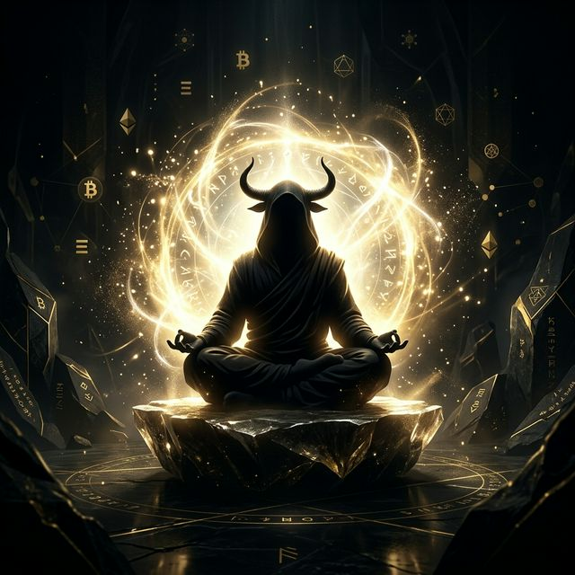

# BullMonk — The Awakened Order 🕉️📈

> _"Panic is the enemy. Patience is power. While others sell… BullMonk becomes stronger."_

Welcome to the official repository for **BullMonk** — a meme coin built on the brutal truth of market psychology. In every cycle, the retail investors chase green candles and panic-sell the red ones, while the whales accumulate silently.

BullMonk is for those who wait. It is discipline in motion.



## 🎯 The Philosophy

This is not just a landing page; it is a **conversion tool** designed to build belief and create FOMO.
The core philosophy is simple:

- We don't chase the market. We become it.
- Diamond hands are forged in the bear market.
- The cycle belongs to the patient.

## 🚀 Features & Tech Stack

The BullMonk landing page is designed to feel premium, mysterious, and philosophical.

- **Framework:** [React 18](https://react.dev/) + [Vite](https://vitejs.dev/)
- **Animations:** [GSAP (GreenSock)](https://gsap.com/) for scroll-triggered staggered reveals and philosophical text fading.
- **Visuals:** Custom HTML5 Canvas for the ambient, floating gold particle background.
- **Styling:** Vanilla CSS with custom glassmorphism components, glowing text, and keyframe animations for floating market candles.
- **Viral Hook:** An interactive "Panic Trader vs BullMonk" quiz engineered to be shared across X and Telegram to drive organic traffic.

## 🛠️ Local Development

To run the BullMonk landing page on your local machine:

1. **Clone the repository:**

   ```bash
   git clone https://github.com/yuvasamrajyaofficial-prog/BullMonk.git
   cd BullMonk
   ```

2. **Install dependencies:**

   ```bash
   npm install
   ```

   _(This project uses `gsap`, `@gsap/react`, and `react-icons`)_

3. **Start the development server:**

   ```bash
   npm run dev
   ```

4. **Open your browser:**
   Navigate to `http://localhost:5173` to view the Awakened Order.

## 📂 Project Structure

```text
src/
├── assets/          # Contains the AI-generated BullMonk protagonist illustration
├── components/      # All 11 React components
│   ├── Hero.jsx     # The focal point: floating candles, breathing monk, and core CTA
│   ├── Solution.jsx # Philosophy cards explaining the BullMonk way
│   ├── Problem.jsx  # Psychological hit: "You bought late, you sold in fear"
│   ├── Roadmap.jsx  # Vertical scroll-triggered phases (Awakening -> Global Order)
│   ├── Quiz.jsx     # Viral interactive component
│   └── ...          # TokenPower, TheOrder, ParticleBackground, etc.
├── App.jsx          # Main assembly of all components and the particle background
├── index.css        # Core design system: fonts (Cinzel, Inter), global colors, animations
└── main.jsx         # React application entry point
```

## 🤝 Join The Order

The cycle has already begun. Are you ready?

- **Telegram:** [Join the Inner Circle](#) _(Link coming soon)_
- **X (Twitter):** [Follow the Awakened](#) _(Link coming soon)_

---

_Disclaimer: $BULLMONK is a meme coin created for entertainment and community building. It has no intrinsic value or expectation of financial return. Cryptocurrencies are highly volatile. Do your own research. Not financial advice._
